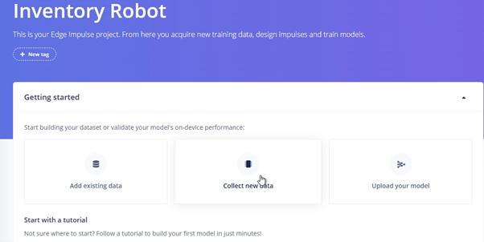
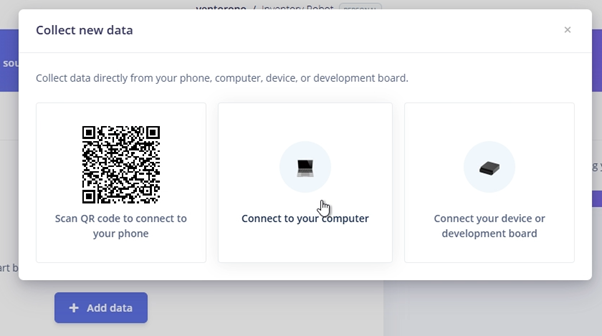
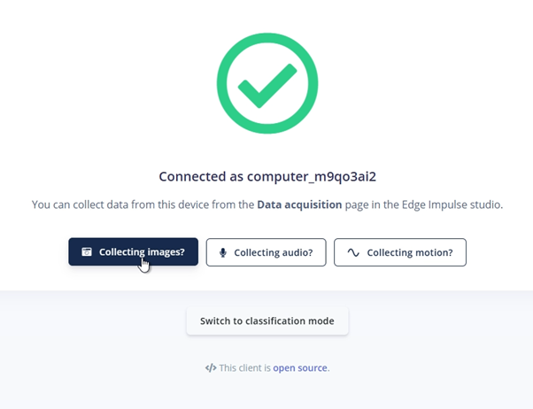
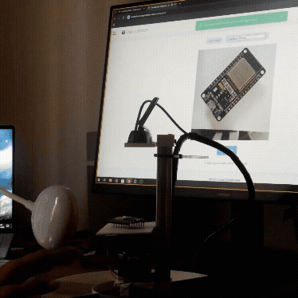

# Smart Inventory Robot (Edeg Impulse + UNO Q)

## Introduction
This project will guide you on how to build your own **Inventory Robot** that can manage and track any item you want to store. It provides a simple and straightforward solution to automate, organize, and segregate your objects.
As a hobbyist, once you're done prototyping, it often becomes difficult to place every component back in its correct location. This robot solves that by automating the process of tracking and arranging items efficiently.

---

## Table of Contents

1. [Problem Understanding](#problem-understanding)  
2. [Solution](#solution)  
3. [What You Will Learn](#what-you-will-learn)  
4. [Build Your Hardware](#build-your-hardware)  
5. [Dataset Preparation](#dataset-preparation)  
6. [Train on Edge Impulse Studio](#train-on-edge-impulse-studio)  
7. [Optimization](#optimization)  
8. [Learnings](#learnings)  
9. [Integrate with UNO Q](#integrate-with-uno-q)  
10. [Arduino App Explanation](#arduino-app-explanation)  
11. [Usage and UI](#usage-and-ui)  
12. [Conclusion](#conclusion)

---
## Problem Understanding

When working on prototypes or hobby projects, components often end up scattered across the workspace. After completing a project, it becomes difficult to identify, sort, and return each item to its correct place. This leads to misplaced components, wasted time searching for parts, and an overall inefficient workflow.

Manual sorting and tracking of items is repetitive and prone to human error. As the number of components grows, maintaining a proper inventory becomes even harder.

The core problem is the lack of an easy, automated system that can:
- Identify items quickly  
- Count them accurately  
- Sort and place them in the right location  
- Keep a consistent record of what’s stored  

This project aims to eliminate these manual tasks by providing an automated, intelligent inventory robot powered by the Arduino UNO Q and Edge Impulse.

## Solution
Explain your overall solution approach.

---

## What You Will Learn
List the key learning points.
1. How to train an ML model int **Edge Impulse**, optimize it in and integrate it into your **Arduino UNO Q app**.
3. Use the core feature of Arduino UNO Q, that is seamless communication from your software to hardware using the Bridge API.
4. Use this software solution for your own hardware setup.

**To help you build your complete solution I have also built the hardware for you with all the necessary hardware and STL files**  
**The Robot comprises of a very simple design and has been designed to demonstrate the capabilities of Arduino UNO Q and Edge Impulse for this Application**

---

## Build Your Hardware
Instructions or images about assembling the hardware.

---

## Dataset Preparation
To prepare your dataset, follow these steps (images below show the process):

### Create your project

  

### Collect images
- Use the camera that you will be using in your actual robot, connect it to your PC and take photos.

  
  

### Select on "collecting images" 
- Provide the permission, if prompted by your browser.

  

### Capture your images one by one (Label is not the actual labelling in this case, it is to let you identify your captured images easily)
- Make sure to edit the label, it lets you identify what images you have captured for sorting them later.
- Capture images in various lighting conditions/orientations as shown in the gif.
- Choose Training Dataset first (Capture approximately 200 images)
- Then choose Testing dataset for around 40 images.

  
  

- You may ask, why 200 images and not more? To our advantage, the background of the camera feed stays constant, i.e. the white platform in this case.

### Label your images with a bounbding box:
Navigate to the Label Dataset present at the top menu, draw a bounding box which approximately borders your object.

  

---

## Train on Edge Impulse Studio
Training steps, screenshots, settings, etc.

---

## Optimization
Explain improvements, model tuning, latency reductions, etc.

---

## Learnings
Write what you learned during the build.

---

## Integrate with UNO Q
Steps to integrate your model with the Arduino UNO Q.

---

## Arduino App Explanation
Explain how your Arduino App works.

---

## Usage and UI
Explain how to use the robot and describe the UI.

---

## Conclusion
Summarize the project and end notes.

