# Smart Inventory Robot (Edeg Impulse + UNO Q)

## Introduction

This project walks you through building your own **Inventory Robot** that can automatically identify, organize, and track the components you use in your workspace. After finishing a prototype, placing every part back in the right spot can become time-consuming and difficult. This robot solves that by intelligently sorting and maintaining a clear inventory of your items.

Whether you are a beginner or a hobbyist, this guide makes it simple to understand how the robot works, how to train your machine learning model on **Edge Impulse**, and how to integrate everything with the **Arduino UNO Q**.

---

## Table of Contents

1. [Problem Understanding](#1-problem-understanding)
2. [Solution](#2-solution)
3. [What You Will Learn](#3-what-you-will-learn)
4. [Hardware Design](#4-hardware-design)
5. [Dataset Preparation](#5-dataset-preparation)
6. [Train on Edge Impulse Studio](#6-train-on-edge-impulse-studio)
7. [Optimized Model](#7-optimized-model)
8. [Integrate with UNO Q](#8-integrate-with-uno-q)
9. [Arduino App Explanation](#9-arduino-app-explanation)
10. [Usage and UI](#10-usage-and-ui)
11. [Conclusion](#11-conclusion)

---

## 1. Problem Understanding

When working on electronics projects, components often get scattered all over the workspace. After finishing your work, identifying and sorting them back into their correct locations becomes tiring. This leads to misplaced parts, wasted time searching, and reduced productivity.

Manual sorting is repetitive and error-prone. As your component collection grows, keeping track of everything becomes even harder.

This project focuses on creating an automated system that can:

* Quickly identify items
* Count them accurately
* Sort and position them correctly
* Maintain a consistent, updated inventory

With the Arduino UNO Q and Edge Impulse, this project eliminates the repetitive steps and builds a smart, reliable solution.

---

## 2. Solution

Explain your overall solution approach.

---

## 3. What You Will Learn

Here are the key concepts you’ll learn while building this project:

1. How to train an ML model in **Edge Impulse**, optimize it, and integrate it into your **Arduino UNO Q** application.
2. How to utilize the UNO Q’s core ability—seamless software-to-hardware communication through the **Bridge API**.
3. How to adapt this software workflow to your own hardware setup.

**To make the process easier, I have also built the entire hardware and included all the STL files you need.**
The robot has a simple design focused on showcasing how the Arduino UNO Q and Edge Impulse can work together for smart inventory management.

---

## 4. Hardware Design

Instructions or images about assembling the hardware.

---

## 5. Dataset Preparation

Follow these steps to prepare your dataset:

* Select 5 different objects for training.
* For each object, capture around **240 images** (200 for training, 40 for testing).

<p align="left">
  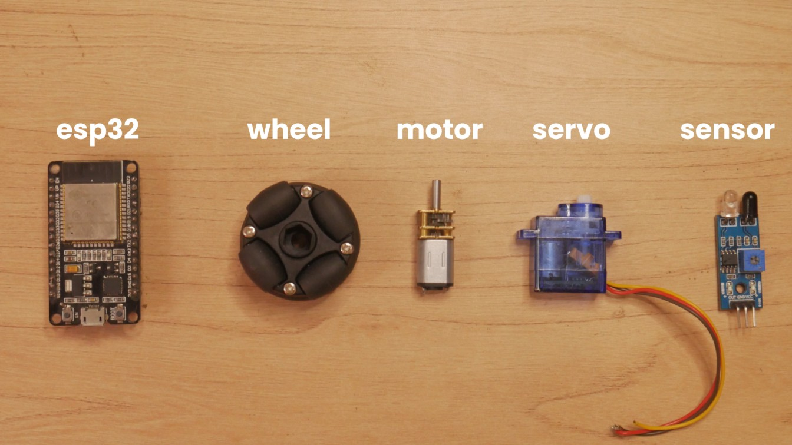
</p>

### Create your project

<p align="left">
  
</p>

### Collect images

Use the same camera you plan to use in the robot. Connect it to your PC and capture all the images.

<p align="left">
  
  
</p>

### Select “Collecting images”

Allow camera permissions if requested.
  


### Capture images one by one

* Edit the label to help you identify categories later.
* Capture in different orientations and lighting conditions.
* Choose **Training** dataset first (200 images), then **Testing** dataset (40 images).

  
  


### Label your images with bounding boxes

* Go to **Labeling Queue**.
* Draw a bounding box around the object.
* Click **Save label** to move to the next image.
* Edge Impulse intelligently estimates bounding boxes for consecutive images.
  


You can also use AI-based auto-labeling using OpenAI or Gemini API keys.

Repeat this process for all objects.

---

## 6. Train on Edge Impulse Studio

### How do you know what to choose?

Training is an experimental process—try models, adjust parameters, and iterate until you get the performance you need.

Before we dive in, here is a summary of my experiments,.

| Experiment               | Model Used                       | Input Size | Data Augmentation | Accuracy / F1 Score              | Model Size |
| ------------------------ | -------------------------------- | ---------- | ----------------- | -------------------------------- | ---------- |
| **Experiment 1**         | MobileNetV2 SSD FPN-Lite 320x320 | 320×320    | ❌ No              | ~87% accuracy                    | **11 MB**  |
| **Experiment 2**         | FOMO MobileNetV2 0.35            | 90×90      | ❌ No              | Good F1 score but lower accuracy | **106 KB**  |
| **Experiment 3 (Final)** | **FOMO MobileNetV2 0.35**        | **90×90**  | **✔️ Yes**        | **High accuracy & precision**    | **106 KB** |

### **Training Steps (Overview)**

1. [Create an Impulse](#creating-an-impulse)
2. [Generate Features](#generate-features)
3. [Train the Model](#train-the-model)
4. [Model Testing (Classify All)](#testing)
5. [Select Arduino UNO Q as Target](#deployment-summary)
6. [Deploy the Model (.eim File)](#integrate-with-uno-q)

---


### Creating an Impulse

* Go to **Create Impulse**.
* An impulse processes raw data into features and uses a learning block for classification.

### Experiment 1

Trying **MobileNetV2 SSD FPN-Lite 320x320** required resizing inputs to **320×320**.
  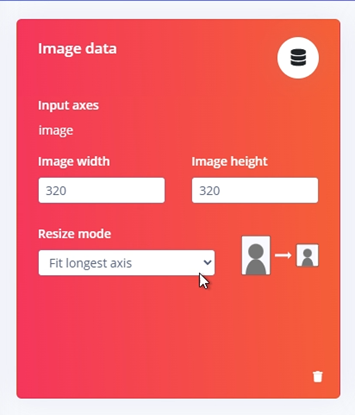


Added processing and learning blocks: <br>


  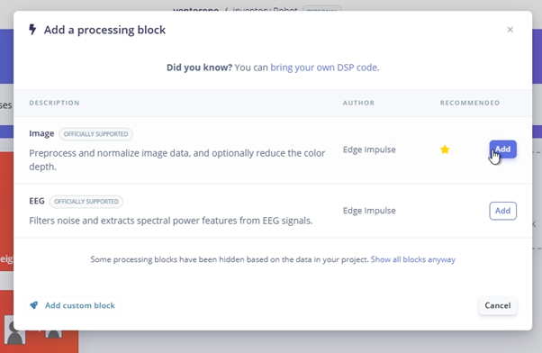
  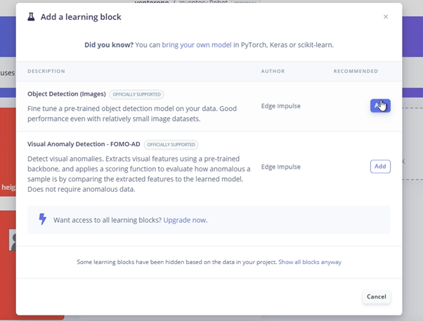


### Generate features:
- Navigate to the "Image" section to save parameters and generate feastures.<br>

  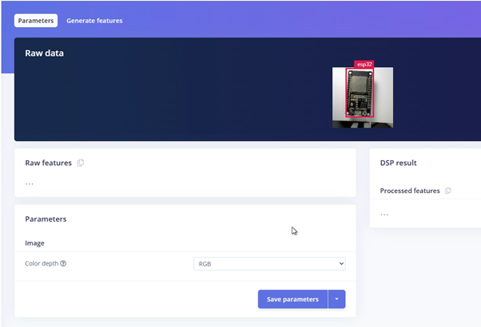
  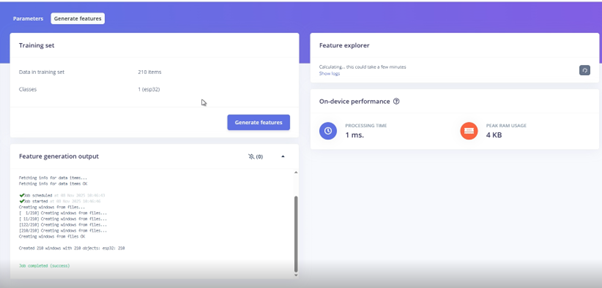


### Train the model
Selected the **MobileNetV2 SSD FPN-Lite 320x320** model in the **Object Detection** section, hit **Save & Train**:<br>
  


Training time is limited by Edge Impulse (1 hour), so around 25–30 epochs are possible.<br>

Results:<br>
  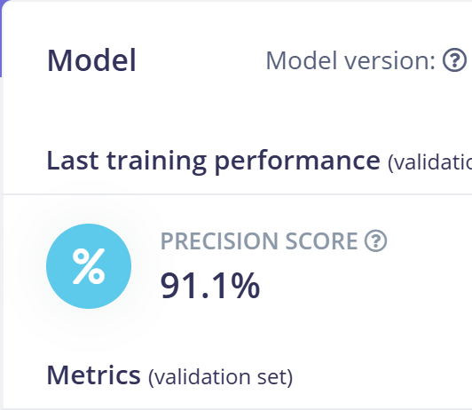


### Testing

Using **Live Classification** or **Model Testing → Classify all**:<br>
  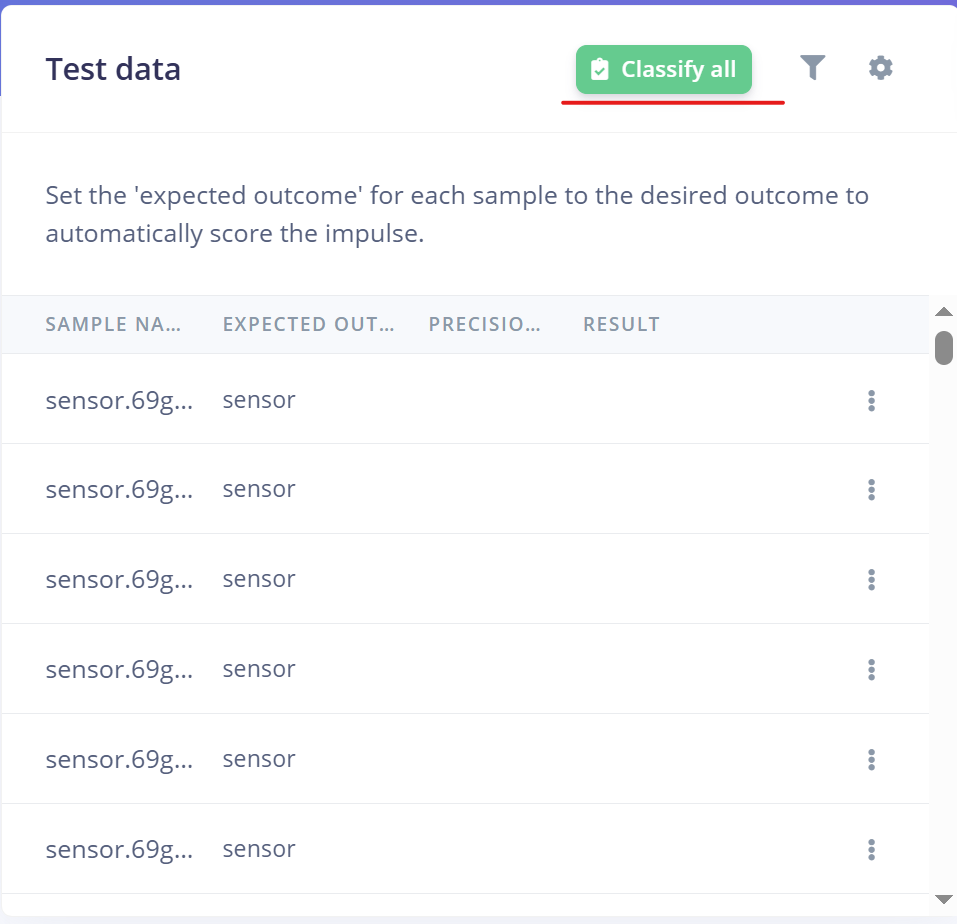
  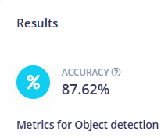


Accuracy was around **87%**. Good, but we can improve this.

### Deployment summary

After selecting **Arduino UNO Q** as the target:<br>

  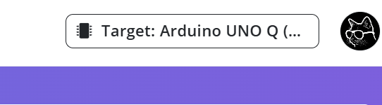
  <br>
  

On deploying:<br>

  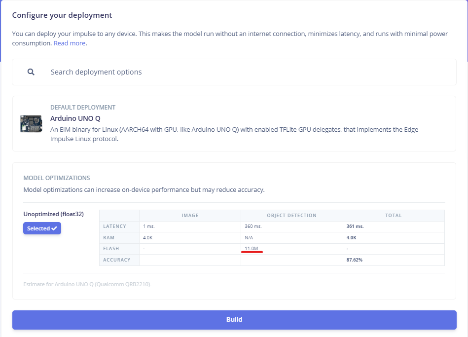

### Learnings from Experiment 1

* Model size was large (**11 MB**)
* Accuracy and precision can be improved
* Input size (320×320) is unnecessarily big

---

## Experiment 2

Same pipeline, but now:

* Input size changed to **90×90**
* Model switched to **FOMO MobileNetV2 0.35** (supports arbitrary image sizes)

### Impulse

  


Training setup (no augmentation enabled):<br>

  


F1 score:<br>
  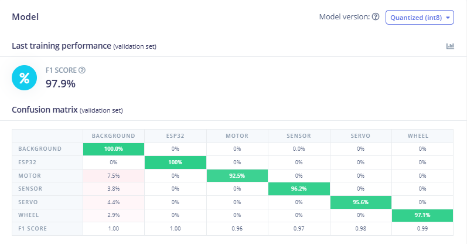


Model accuracy:<br>

  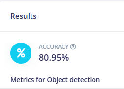

---

## 7. Optimized Model

### Experiment 3 (Final)

Everything remained the same except enabling **Data Augmentation**:

  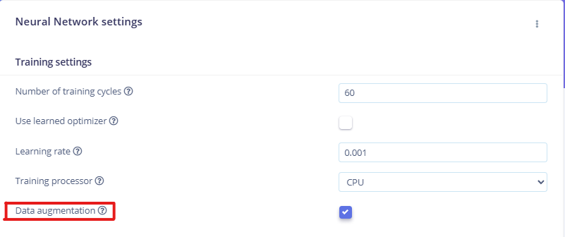


Precision:

  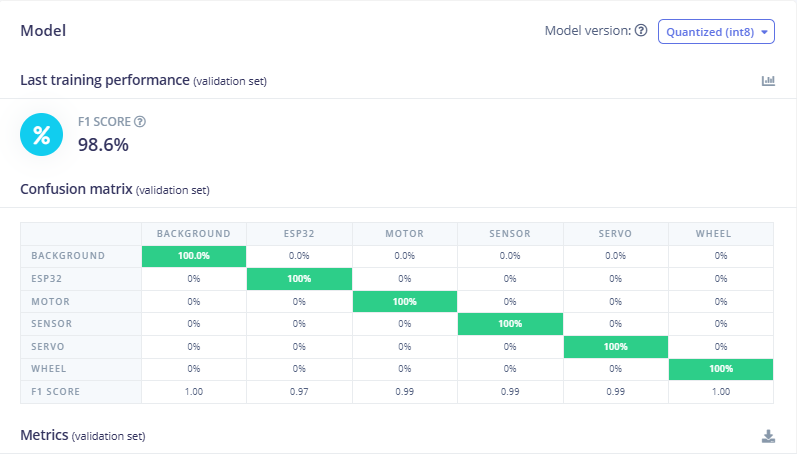


Accuracy:

  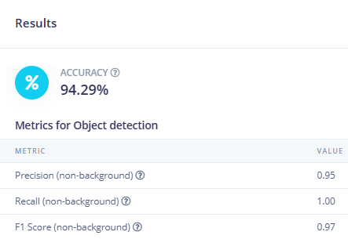


### Why this worked better

* Data augmentation prevents overfitting
* Model becomes more robust to variations
* Model size reduced from **11 MB → 106 KB**
* Training speed significantly improved

### Summary of Experiments


---

If you'd like, I can also add a short one-line takeaway below the table.


---

## 8. Integrate with UNO Q

### Setup the Arduino UNO Q as a Single Board Computer:
[Arduino Uno Q Single-Board Computer Set](https://docs.arduino.cc/tutorials/uno-q/single-board-computer/)

If you face issues with App Lab on your board, consider reflashing it with a new image:
<br>
[Flash a new Image](https://docs.arduino.cc/tutorials/uno-q/update-image/)

### Once your UNO Q is setup and ready, login to your **Edge Impulse Account**
You’ll need the **.eim** file from Edge Impulse.
Go to **Deployment → Build**
The `.eim` file downloads automatically once the build completes.
<p align="left">
  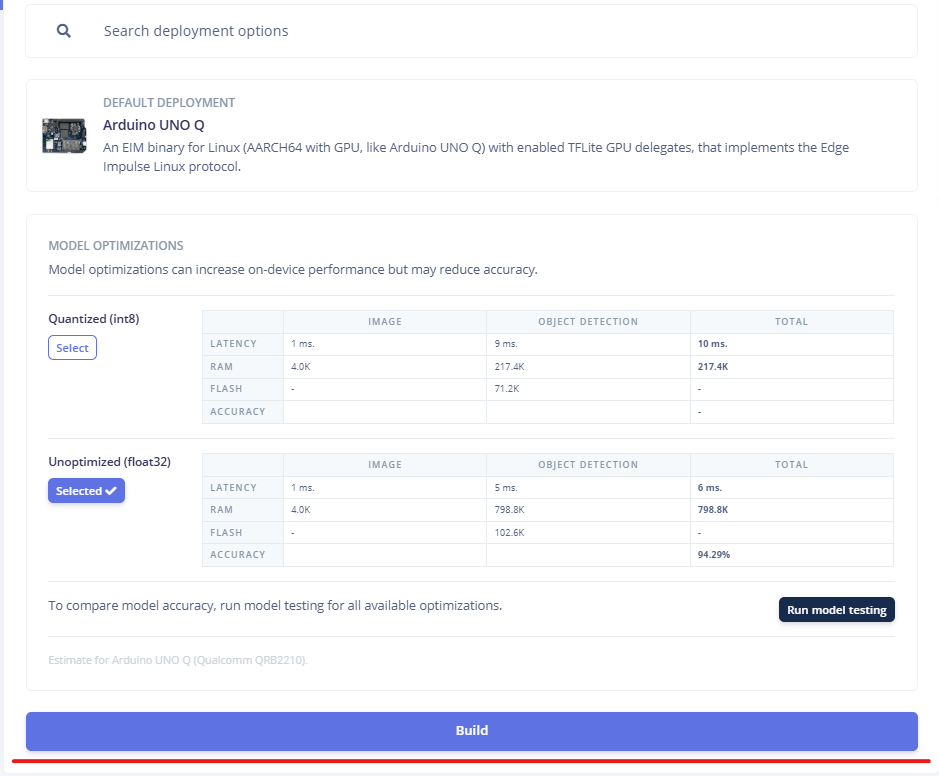
</p>

### Download this repository on your UNO Q, and store the Unzipped Folder inside the **Arduino Apps** Folder.

---

## 9. Arduino App Explanation

File Structure:
<br>
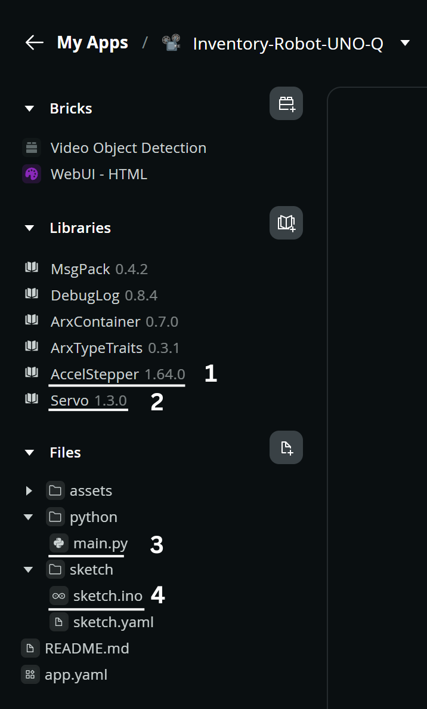
<br>
File description:
1. Accelstepper Library
2. Servo Library
3. Python Code
4. Arduino Sketch

You can add libraries just like how you do in Arduino IDE, by pressing the button next to "Library"

Under assets, you can view the **index.html** and **app.js** which you can modify for your use case too:
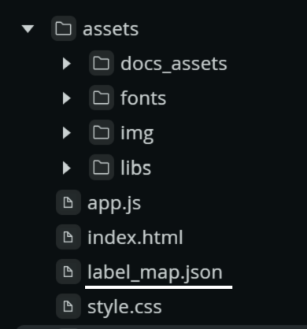


### The label_map.json is an important file:
This is where you can add
- A new object
- Its position
- Its total count
<br>
Here's an example of its representation in the file:

| object | position | total count |
|--------|----------|--------------|
| esp32  | 2        | 15           |


### I have initialized all the count values as 0 because the robot will update its count automatically as it places them in their respective positions

```json
{
  "esp32": [2,0],
  "servo": [3,0],
  "motor": [3,0],
  "wheel": [4,0],
  "sensor": [5,0]
}
```


## Interaction Between Python and Arduino

### **Python Logic**

```python
def send_detections_to_ui(detections: dict):
    global paused, pick_mode

    if paused:
        return

    now = time.time()

    for key, value in detections.items():
        conf = value.get("confidence", 0)

        if conf * 100 < 85 or key not in label_map:
            continue
        if now - last_detection_time.get(key, 0) < DETECTION_COOLDOWN:
            continue

        last_detection_time[key] = now

        if pick_mode:
            label_map[key][1] = max(0, label_map[key][1] - 1)
        else:
            label_map[key][1] += 1
            Bridge.notify("stepper", label_map[key][0])   # send position to UNO Q
            paused = True

        save_label_map()
        ui.send_message("count_update", {"label": key, "count": label_map[key][1]})

detection_stream.on_detect_all(send_detections_to_ui)
```

**Summary:**

* Only detections above **85% confidence** are considered.
* For each valid detection, Python sends the object’s **position index** to the UNO Q using `Bridge.notify("stepper", position)`.
* Python enters a **paused** state until the microcontroller confirms that the item has been placed.

---

### **Arduino Logic**

Below is a minimal skeleton showing how the UNO Q receives commands and sends back acknowledgements:

```cpp
#include <Arduino_RouterBridge.h>

long positions[6] = {0, 33, 66, 99, 132, 165};

void movePos(int n) {
    // your hardware logic here (stepper, servo, etc.)

    int var = 0;
    Bridge.notify("ack", var);   // send ack back to Python
}

void setup() {
    Bridge.begin();
    Monitor.begin(115200);
    // initialization logic
}

void loop() {
    Bridge.provide("stepper", movePos);  // listen for "stepper" events from Python
}
```

**Summary:**

* `Bridge.provide("stepper", movePos)` waits for Python to send a position.
* The received integer `n` tells the motor which container to move to.
* Once the object is dropped, Arduino sends back `Bridge.notify("ack", 0)`.

---

### **Python Resumes Detection After Ack**

```python
def resume(val: int):
    global paused
    if val == 0:
        paused = False

Bridge.provide("ack", resume)
```

**Summary:**

* Arduino’s acknowledgment (`ack = 0`) triggers the Python code to **unpause**.
* The detection loop continues only after the robot finishes placing the object.
* Other parts of the code handle the features of the UI

---

## 10. Usage and UI

Explain how to use the robot and describe the UI.

---

## 11. Conclusion

Summarize the project and end notes.

